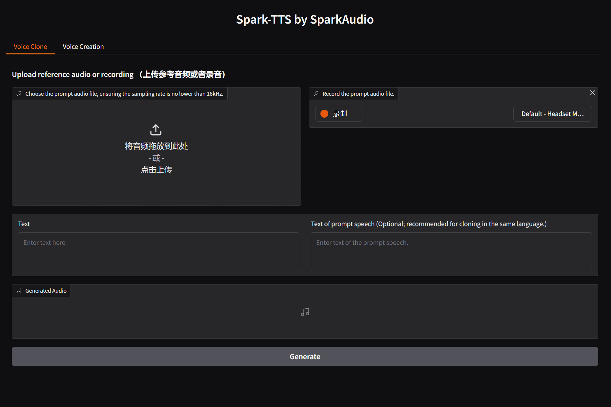

<div align="center">
    <h1>
    SparkTTS-API (Fork from SparkAudio/Spark-TTS)
    </h1>
    <p>
    Official PyTorch code for inference of <br>
    <b><em>Spark-TTS: An Efficient LLM-Based Text-to-Speech Model with Single-Stream Decoupled Speech Tokens</em></b>
    </p>
    <p>
    
    </p>
        <p>
        
        
        
    </p>
    <p>
        
        
        
    </p>
    <p>
    </p>
    <a href="https://arxiv.org/pdf/2503.01710"></a>
    <a href="https://sparkaudio.github.io/spark-tts/"></a>
    <a href="https://huggingface.co/SparkAudio/Spark-TTS-0.5B"></a>
    <a href="https://github.com/SparkAudio/Spark-TTS"></a>
    <a href="https://github.com/SparkAudio/Spark-TTS"></a>
    <a href="https://github.com/SparkAudio/Spark-TTS"></a>
    <a href="https://github.com/SparkAudio/Spark-TTS"></a>
</div>


## Spark-TTS 🔥

### Overview

Spark-TTS is an advanced text-to-speech system that uses the power of large language models (LLM) for highly accurate and natural-sounding voice synthesis. It is designed to be efficient, flexible, and powerful for both research and production use.

### Key Features

- **Simplicity and Efficiency**: Built entirely on Qwen2.5, Spark-TTS eliminates the need for additional generation models like flow matching. Instead of relying on separate models to generate acoustic features, it directly reconstructs audio from the code predicted by the LLM. This approach streamlines the process, improving efficiency and reducing complexity.
- **High-Quality Voice Cloning**: Supports zero-shot voice cloning, which means it can replicate a speaker's voice even without specific training data for that voice. This is ideal for cross-lingual and code-switching scenarios, allowing for seamless transitions between languages and voices without requiring separate training for each one.
- **Bilingual Support**: Supports both Chinese and English, and is capable of zero-shot voice cloning for cross-lingual and code-switching scenarios, enabling the model to synthesize speech in multiple languages with high naturalness and accuracy.
- **Controllable Speech Generation**: Supports creating virtual speakers by adjusting parameters such as gender, pitch, and speaking rate.

---

<table align="center">
  <tr>
    <td align="center"><b>Inference Overview of Voice Cloning</b><br></td>
  </tr>
  <tr>
    <td align="center"><b>Inference Overview of Controlled Generation</b><br></td>
  </tr>
</table>


## 🚀 News

- **[2025-03-04]** Our paper on this project has been published! You can read it here: [Spark-TTS](https://arxiv.org/pdf/2503.01710). 

- **[2025-03-12]** Nvidia Triton Inference Serving is now supported. See the Runtime section below for more details.


## Install
**Clone and Install**

  Here are instructions for installing on Linux. If you're on Windows, please refer to the [Windows Installation Guide](https://github.com/SparkAudio/Spark-TTS/issues/5).  
*(Thanks to [@AcTePuKc](https://github.com/AcTePuKc) for the detailed Windows instructions!)*


- Clone the repo
``` sh
git clone https://github.com/SparkAudio/Spark-TTS.git
cd Spark-TTS
```

- Install Conda: please see https://docs.conda.io/en/latest/miniconda.html
- Create Conda env:

``` sh
conda create -n sparktts -y python=3.12
conda activate sparktts
pip install -r requirements.txt
# If you are in mainland China, you can set the mirror as follows:
pip install -r requirements.txt -i https://mirrors.aliyun.com/pypi/simple/ --trusted-host=mirrors.aliyun.com
```

**Model Download**

Download via python:
```python
from huggingface_hub import snapshot_download

snapshot_download("SparkAudio/Spark-TTS-0.5B", local_dir="pretrained_models/Spark-TTS-0.5B")
```

Download via git clone:
```sh
mkdir -p pretrained_models

# Make sure you have git-lfs installed (https://git-lfs.com)
git lfs install

git clone https://huggingface.co/SparkAudio/Spark-TTS-0.5B pretrained_models/Spark-TTS-0.5B
```

**Basic Usage**

You can simply run the demo with the following commands:
``` sh
cd example
bash infer.sh
```

Alternatively, you can directly execute the following command in the command line to perform inference：

``` sh
python -m cli.inference \
    --text "text to synthesis." \
    --device 0 \
    --save_dir "path/to/save/audio" \
    --model_dir pretrained_models/Spark-TTS-0.5B \
    --prompt_text "transcript of the prompt audio" \
    --prompt_speech_path "path/to/prompt_audio"
```

**Web UI Usage**

You can start the UI interface by running `python webui.py --device 0`, which allows you to perform Voice Cloning and Voice Creation. Voice Cloning supports uploading reference audio or directly recording the audio.


| **Voice Cloning** | **Voice Creation** |
|:-------------------:|:-------------------:|
|  |  |


**Optional Methods**

For additional CLI and Web UI methods, including alternative implementations and extended functionalities, you can refer to:

- [CLI and UI by AcTePuKc](https://github.com/SparkAudio/Spark-TTS/issues/10)

**HTTP API Usage**

You can interact with the SparkTTS API by sending HTTP requests. First, you need to start the API server:

```bash
python api_server.py --model_dir pretrained_models/Spark-TTS-0.5B --device 0 --host 0.0.0.0 --port 8000
```

The API provides two main endpoints:

1.  **`/tts/create` (POST)**: Creates synthetic speech based on the provided text and parameters (gender, pitch, speed).
2.  **`/tts/clone` (POST)**: Synthesizes the specified text using a voice cloned from the provided prompt audio.

Below are examples using the Python `requests` library to call these endpoints:

**Example 1: Create Voice (`/tts/create`)**

```python
import requests

url = "http://localhost:8000/tts/create"

payload = {
    'text': 'Hello, world! This is a text-to-speech test.',
    'gender': 'female',  # Valid values: 'female', 'male'
    'pitch': 'moderate', # Valid values: 'very_low', 'low', 'moderate', 'high', 'very_high'
    'speed': 'moderate'  # Valid values: 'very_low', 'low', 'moderate', 'high', 'very_high'
}

try:
    response = requests.post(url, data=payload)
    response.raise_for_status() # Check if the request was successful

    # Save the response content as a WAV file
    with open('created_audio.wav', 'wb') as f:
        f.write(response.content)
    print("Voice creation successful, audio saved as created_audio.wav")

except requests.exceptions.RequestException as e:
    print(f"Request failed: {e}")
    # Try to print more detailed error information from the server
    try:
        print(f"Server returned error: {response.text}")
    except NameError: # If response failed before raise_for_status()
        pass
except Exception as e:
    print(f"An error occurred while processing the response: {e}")

```

**Example 2: Clone Voice (`/tts/clone`)**

```python
import requests

url = "http://localhost:8000/tts/clone"

# Ensure you have a prompt audio file named 'prompt.wav' in the current directory
prompt_audio_path = 'prompt.wav'
# Text transcription of the prompt audio (optional, but recommended for better results)
prompt_text = 'This is the text content of the prompt audio.'

payload = {
    'text': 'This is text synthesized based on the cloned voice.',
    'prompt_text': prompt_text # Optional
    # Optional gender, pitch, speed parameters can also be added for fine-tuning
    # 'gender': 'male',
    # 'pitch': 'high',
    # 'speed': 'low'
}

files = {
    'prompt_audio': (prompt_audio_path, open(prompt_audio_path, 'rb'), 'audio/wav')
}

try:
    response = requests.post(url, data=payload, files=files)
    response.raise_for_status() # Check if the request was successful

    # Save the response content as a WAV file
    with open('cloned_audio.wav', 'wb') as f:
        f.write(response.content)
    print("Voice cloning successful, audio saved as cloned_audio.wav")

except FileNotFoundError:
    print(f"Error: Prompt audio file '{prompt_audio_path}' not found.")
except requests.exceptions.RequestException as e:
    print(f"Request failed: {e}")
    # Try to print more detailed error information from the server
    try:
        print(f"Server returned error: {response.text}")
    except NameError:
        pass
except Exception as e:
    print(f"An error occurred while processing the response: {e}")
finally:
    # Close the file handle
    if 'prompt_audio' in files and files['prompt_audio'][1]:
        files['prompt_audio'][1].close()
```

**Return Values**

*   **Success**: HTTP status code `200 OK`. The response body is the binary content of the generated WAV audio file (`Content-Type: audio/wav`).
*   **Failure**:
    *   HTTP status code `422 Unprocessable Entity`: Invalid request parameters (e.g., missing required parameters, or parameter values outside the allowed range). The response body will contain a JSON object describing the error.
    *   HTTP status code `500 Internal Server Error`: The server encountered an error during request processing or model inference. The response body may contain error details.

For example, a `422` error response body might look like this:

```json
{
  "detail": [
    {
      "loc": [
        "body",
        "pitch"
      ],
      "msg": "value is not a valid integer",
      "type": "type_error.integer"
    }
  ]
}
```

Please note that you need to start `api_server.py` before running these examples, and for the voice cloning example, you need to prepare a prompt audio file named `prompt.wav`.

## Runtime

**Nvidia Triton Inference Serving**

We now provide a reference for deploying Spark-TTS with Nvidia Triton and TensorRT-LLM. The table below presents benchmark results on a single L20 GPU, using 26 different prompt_audio/target_text pairs (totalling 169 seconds of audio):

| Model | Note   | Concurrency | Avg Latency     | RTF | 
|-------|-----------|-----------------------|---------|--|
| Spark-TTS-0.5B | [Code Commit](https://github.com/SparkAudio/Spark-TTS/tree/4d769ff782a868524f29e0be851ca64f8b22ebf1/runtime/triton_trtllm) | 1                   | 876.24 ms | 0.1362|
| Spark-TTS-0.5B | [Code Commit](https://github.com/SparkAudio/Spark-TTS/tree/4d769ff782a868524f29e0be851ca64f8b22ebf1/runtime/triton_trtllm) | 2                   | 920.97 ms | 0.0737|
| Spark-TTS-0.5B | [Code Commit](https://github.com/SparkAudio/Spark-TTS/tree/4d769ff782a868524f29e0be851ca64f8b22ebf1/runtime/triton_trtllm) | 4                   | 1611.51 ms | 0.0704|


Please see the detailed instructions in [runtime/triton_trtllm/README.md](runtime/triton_trtllm/README.md ) for more information.


## **Demos**

Here are some demos generated by Spark-TTS using zero-shot voice cloning. For more demos, visit our [demo page](https://sparkaudio.github.io/spark-tts/).

---

<table>
<tr>
<td align="center">
    
**Donald Trump**
</td>
<td align="center">
    
**Zhongli (Genshin Impact)**
</td>
</tr>

<tr>
<td align="center">

[Donald Trump](https://github.com/user-attachments/assets/fb225780-d9fe-44b2-9b2e-54390cb3d8fd)

</td>
<td align="center">
    
[Zhongli](https://github.com/user-attachments/assets/80eeb9c7-0443-4758-a1ce-55ac59e64bd6)

</td>
</tr>
</table>

---

<table>

<tr>
<td align="center">
    
**陈鲁豫 Chen Luyu**
</td>
<td align="center">
    
**杨澜 Yang Lan**
</td>
</tr>

<tr>
<td align="center">
    
[陈鲁豫Chen_Luyu.webm](https://github.com/user-attachments/assets/5c6585ae-830d-47b1-992d-ee3691f48cf4)
</td>
<td align="center">
    
[Yang_Lan.webm](https://github.com/user-attachments/assets/2fb3d00c-abc3-410e-932f-46ba204fb1d7)
</td>
</tr>
</table>

---


<table>
<tr>
<td align="center">
    
**余承东 Richard Yu**
</td>
<td align="center">
    
**马云 Jack Ma**
</td>
</tr>

<tr>
<td align="center">

[Yu_Chengdong.webm](https://github.com/user-attachments/assets/78feca02-84bb-4d3a-a770-0cfd02f1a8da)

</td>
<td align="center">
    
[Ma_Yun.webm](https://github.com/user-attachments/assets/2d54e2eb-cec4-4c2f-8c84-8fe587da321b)

</td>
</tr>
</table>

---


<table>
<tr>
<td align="center">
    
**刘德华 Andy Lau**
</td>
<td align="center">

**徐志胜 Xu Zhisheng**
</td>
</tr>

<tr>
<td align="center">

[Liu_Dehua.webm](https://github.com/user-attachments/assets/195b5e97-1fee-4955-b954-6d10fa04f1d7)

</td>
<td align="center">
    
[Xu_Zhisheng.webm](https://github.com/user-attachments/assets/dd812af9-76bd-4e26-9988-9cdb9ccbb87b)

</td>
</tr>
</table>


---

<table>
<tr>
<td align="center">
    
**哪吒 Nezha**
</td>
<td align="center">
    
**李靖 Li Jing**
</td>
</tr>

<tr>
<td align="center">

[Ne_Zha.webm](https://github.com/user-attachments/assets/8c608037-a17a-46d4-8588-4db34b49ed1d)
</td>
<td align="center">

[Li_Jing.webm](https://github.com/user-attachments/assets/aa8ba091-097c-4156-b4e3-6445da5ea101)

</td>
</tr>
</table>


## To-Do List

- [x] Release the Spark-TTS paper.
- [ ] Release the training code.
- [ ] Release the training dataset, VoxBox.


## Citation

```
@misc{wang2025sparktts,
      title={Spark-TTS: An Efficient LLM-Based Text-to-Speech Model with Single-Stream Decoupled Speech Tokens}, 
      author={Xinsheng Wang and Mingqi Jiang and Ziyang Ma and Ziyu Zhang and Songxiang Liu and Linqin Li and Zheng Liang and Qixi Zheng and Rui Wang and Xiaoqin Feng and Weizhen Bian and Zhen Ye and Sitong Cheng and Ruibin Yuan and Zhixian Zhao and Xinfa Zhu and Jiahao Pan and Liumeng Xue and Pengcheng Zhu and Yunlin Chen and Zhifei Li and Xie Chen and Lei Xie and Yike Guo and Wei Xue},
      year={2025},
      eprint={2503.01710},
      archivePrefix={arXiv},
      primaryClass={cs.SD},
      url={https://arxiv.org/abs/2503.01710}, 
}
```


## ⚠️ Usage Disclaimer

This project provides a zero-shot voice cloning TTS model intended for academic research, educational purposes, and legitimate applications, such as personalized speech synthesis, assistive technologies, and linguistic research.

Please note:

- Do not use this model for unauthorized voice cloning, impersonation, fraud, scams, deepfakes, or any illegal activities.

- Ensure compliance with local laws and regulations when using this model and uphold ethical standards.

- The developers assume no liability for any misuse of this model.

We advocate for the responsible development and use of AI and encourage the community to uphold safety and ethical principles in AI research and applications. If you have any concerns regarding ethics or misuse, please contact us.